---

### 👋 About Me

I'm a **Bachelor of Software Engineering (Hons)** graduate from **Universiti Teknologi Malaysia**, with a Diploma in Computer Science from **Universiti Malaysia Pahang**. Over the past 5+ years I've been building full-stack projects across the PHP and JavaScript ecosystems — from academic analytics platforms to airline crew scheduling prototypes.

- 🎓 Graduating **UTM** — B. Software Engineering (Hons), GPA 3.46
- ✈️ Recently interned at **Batik Air Malaysia**, building a full-stack Crew Scheduling System
- 🥈 **Silver Medalist** — Malaysia Invention & Innovation Expo (MIIX) 2026
- 🧭 Interested in **Web Development, DevOps, UI/UX & QA**
- 🌱 Currently exploring Python, Java frameworks, and System Design
- ✉️ Reach me at **msafwan.pro@gmail.com**

---

### 🛠️ Featured Projects

<table>
<tr>
<td width="50%">

**🎓 SPIN — Subject Progress Indicator**
Academic analytics platform for Kolej Tingkatan 6 Tawau, replacing manual Excel tracking with real-time GPMP indicators, 4 role-based dashboards, and automated year-end roll-over.
 `PHP` `SQL` `JavaScript` — 🥈 MIIX 2026 Silver Medal

</td>
<td width="50%">

**✈️ Crew Scheduling System — Batik Air**
Full-stack MVC prototype with RESTful APIs replacing manual, spreadsheet-based airline crew rostering. Standby/duty tracking & fatigue analysis across two aircraft fleets.
 `React` `Node.js` `Express` `MySQL`

</td>
</tr>
<tr>
<td width="50%">

**💍 Wafina Wedding Planner**
A private full-stack app to plan a wedding — and family life after it — around Malaysian Islamic customs, with automated financial and logistical planning.
 `Laravel 13` `Livewire` `Tailwind` `SQLite` `Docker`

</td>
<td width="50%">

**🌐 Personal Portfolio**
A dark space/constellation-themed portfolio with a Frutiger Aero light mode, animated skills orbit, and an interactive terminal-style contact section.
 [safwan-portfolio-oglio.netlify.app](https://safwan-portfolio-oglio.netlify.app/)

</td>
</tr>
</table>

---

### ⚙️ Tech Stack

**Languages**

**Frameworks & Libraries**

**Databases**

**Tools & Platforms**

---

### 📊 GitHub Stats

<picture>
  <source media="(prefers-color-scheme: dark)" srcset="https://raw.githubusercontent.com/sfwnbaek/sfwnbaek/output/github-snake-dark.svg" />
  <source media="(prefers-color-scheme: light)" srcset="https://raw.githubusercontent.com/sfwnbaek/sfwnbaek/output/github-snake.svg" />
  
</picture>

---

### 🌍 Connect With Me

*"Im Batman."* 🦇

